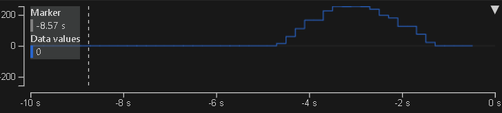

# Microchip_APP-MASTERS25-1_VSCode
Exercise VSCode and APP-MASTERS25-1
  
 

## Important
  
Button of explorer 
hot key is ctrl+shift+e  

  
This is [Command Palette] 
Press ctrl+shift+p ,  show command palette with MPLAB task , usually use this.  
Press ctrl+p , show command palette only, press ">" to show MPLAB task.  
 
## Install VSCode with Microchip extension in ubuntu 22
[ex0](ex00.md) 
  

## Exercise 1 : Using VSCode to flash factory fw which is created by MPLAB X IDE
 
open/import code which created by MPLAB X IDE.

[ex1](ex1.md) 

## Exercise 2 : flash blank project by VScode
[ex2](ex2.md) 

## Exercise 3 : LED1 test, MCC (microchip code configurator)
Just turn on LED1. 
  
[Create a project](ex3a.md) 
[Run MCC and coding](ex3b.md) 
[Build and program to device](ex3c.md) 

# Exercise 4 : Blink LED1 by AI coding
[ex4](ex4.md) 

# Exercise 5 : Blinking LED with timer callback
Please refer to the Masters_2025 teaching course / MCU / Lab1. 
Reading the PDF to get more information. 
The teaching course is for MPLAB X IDE. 
It is ok for VSCode, too. 
[ex5](ex5.md) 

# Exercise 6 : ADC with timer callback, Data Visualizer
Please refer to the Masters_2025 teaching course / MCU / Lab2. 
Reading the PDF to get more information. 
The teaching course is for MPLAB X IDE. 
It is ok for win10 VSCode, too. 
ubuntu 22  VSCode, need below command for ttyACM0:   
sudo usermod -aG dialout \<username\>  
 
[ex6](ex6.md) 

# Exercise 7 : ADC, Data Visualizer, Time Plot, by AI coding
 
[ex7](ex7.md) 

# Exercise 7 : OLED SSD1306
Please refer to the Masters_2025 teaching course / MCU / Lab3. 
Reading the PDF to get more information. 
The teaching course is for MPLAB X IDE. 
It is ok for ubuntu 22 VSCode, too. 
## In progress
