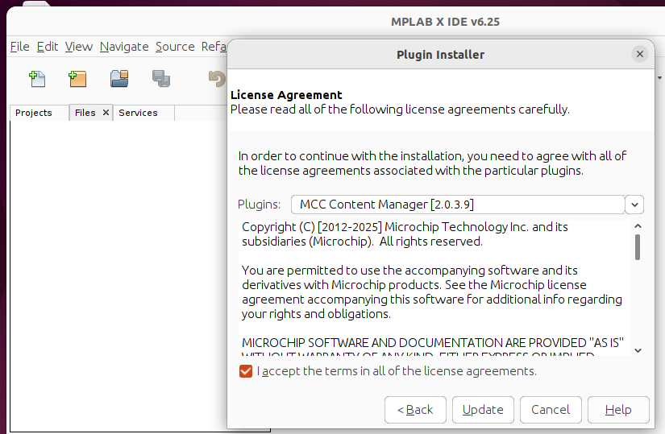
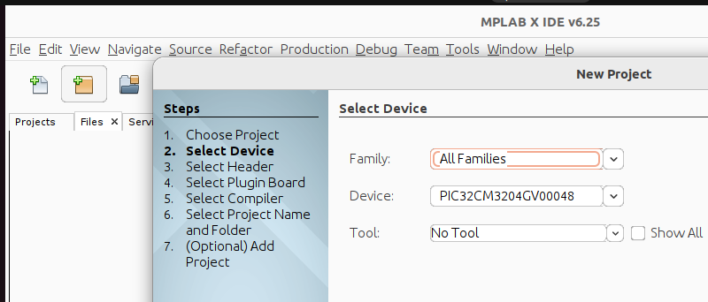
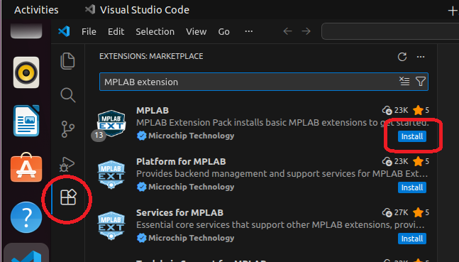
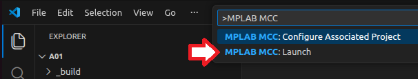
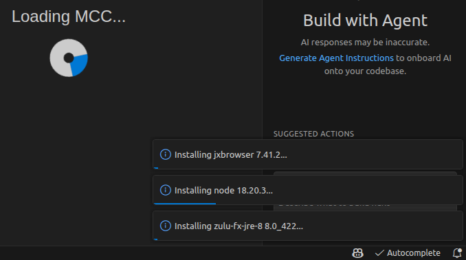
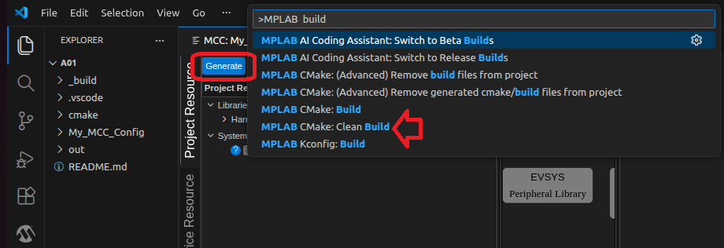
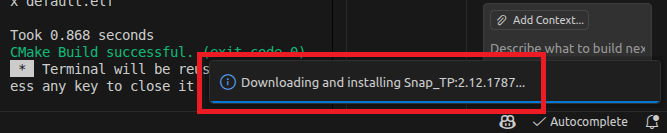
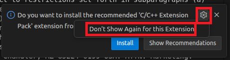
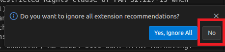

# Install Microchip VSCode in ubuntu 22.04.5

It semms that VSCode DFPs need to open MPLAB_X_IDE project and install them. 
Thus,  
install MPLAB_X_IDE,  
create a blank project,  
install VSCode and extension,  
open MPLAB_X_IDE project to install DFP.  
 
感覺,灌VSCode with Microchip extension, 有點運氣運氣的,  
vmware SL大法, 經驗是先灌MPLAB_X_IDE, 再灌VSCode, 伴隨多次手動重新啟動,觸發VSCode安裝相關軟件,應該灌得起來. 
必要時, 讓VSCode開MPLAB_X_IDE的案子,會載入相關DFP軟件. 
EVK is APP-MASTERS25-1 
MCU is PIC32CM3204GV00048. 
  
## add deb
sudo apt install -y \ 
  libxext6 libxrender1 libxtst6 libxi6 libfreetype6 \ 
  libusb-1.0-0 

## install MPLABX-6.25-linux-installer.sh
sudo sh MPLABX-6.25-linux-installer.sh  
// Only install XC32 
  

### reboot system once - reboot system once - reboot system once
click and install some software package.  
  
  
  
### reboot system once - reboot system once - reboot system once
  
## OK, You can create a blank project with MPLAB_X_IDE in ubuntu 22. MCC, build, program device.
  

## install vscode 
sudo dpkg -i code_1.107.1-1765982436_amd64.deb

## install Microchip extension
  

## fill in AI API Key
  
  
  Auto install python
  
## creat a blank project, and VSCode ask some setting manually.
  
  
### reboot system once - reboot system once - reboot system once
  
  
  
## Run MCC
  
  
  
  
  
## Clean Build
  
## Check programmer
  
## Program device
  
  
  

## Try AI coding
   

# Note
   
   
   