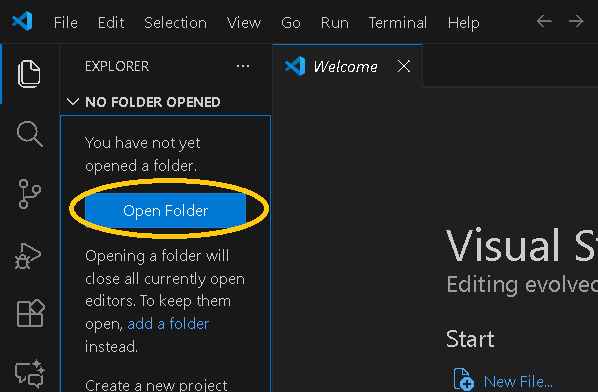
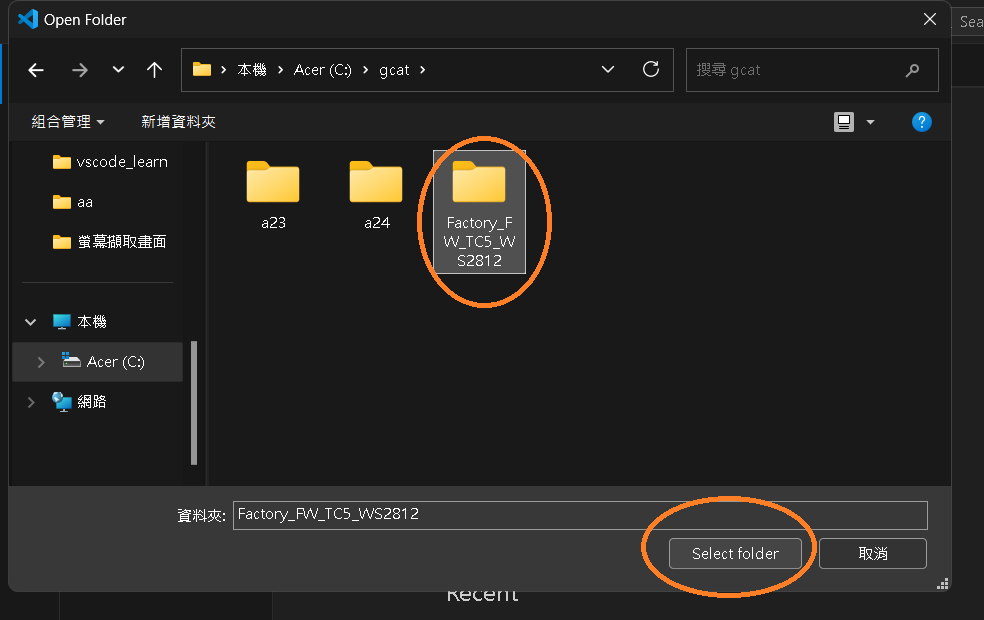
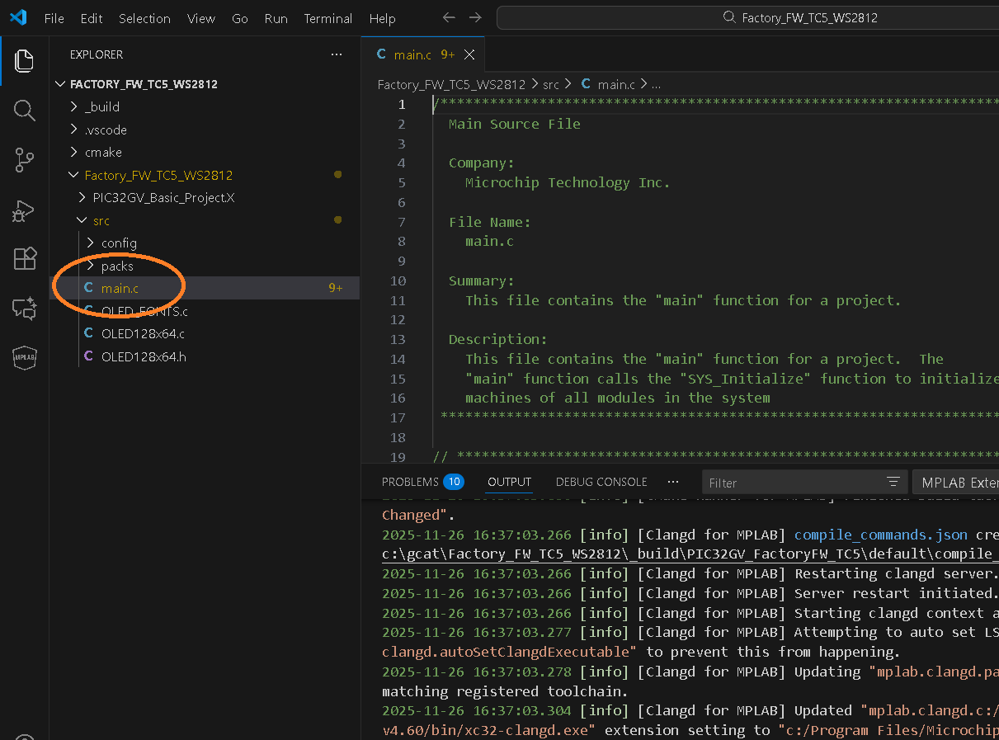
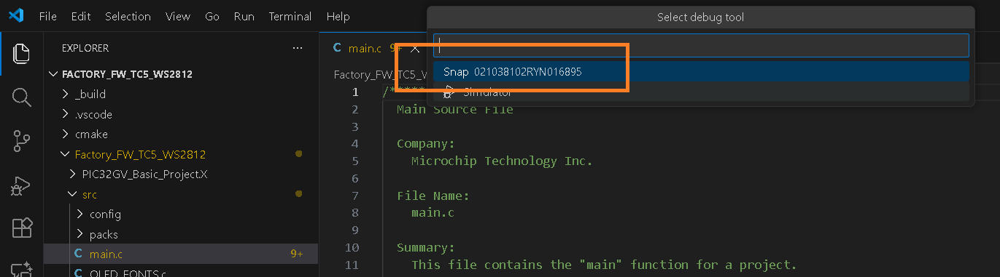
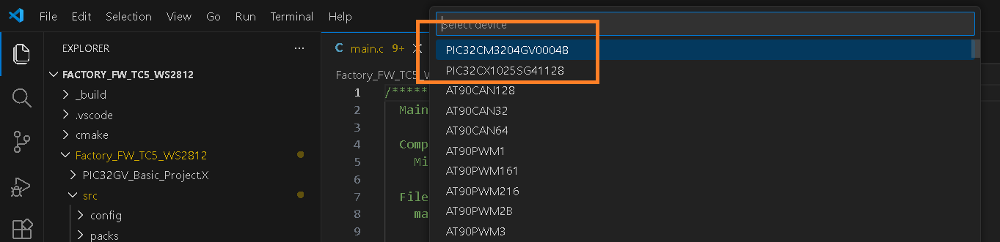
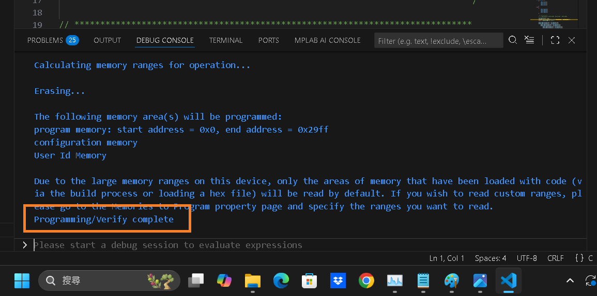

# Exercise 1 flash factory fw by VScode

  
select [Open Folder]  

  
select folder 

  
Must select [Yes] 

  
Select main.c , computer will run seconds 

  
press ">", select MPLAB CMake:Clean Build 

  
Message of build ok  

  
press ">", select MPLAB:Program Device 

  
select hex file  

  
select programmer  

  
select MCU  

  
Message of prgramming ok  