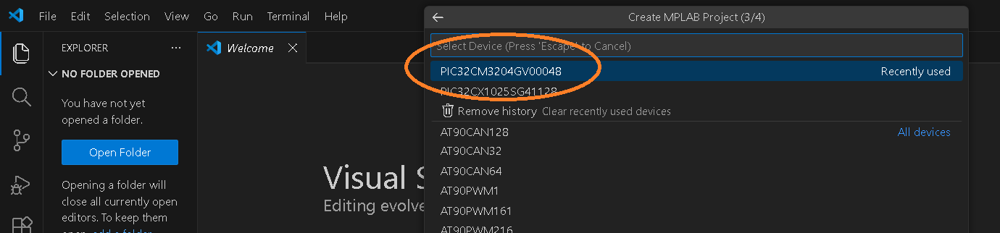
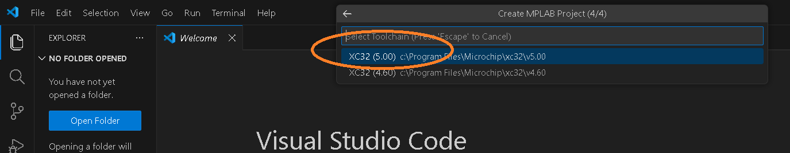
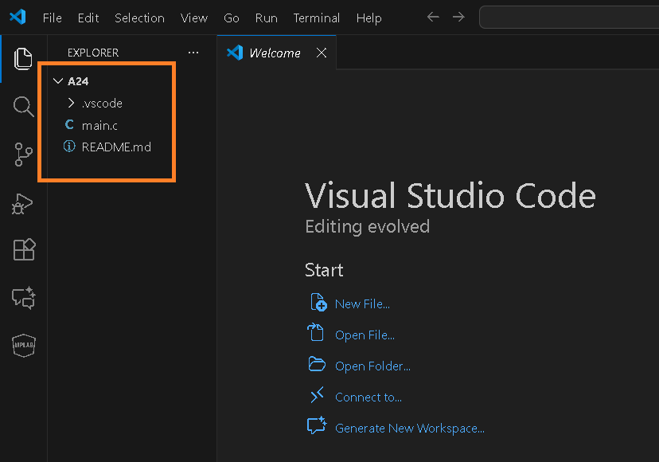
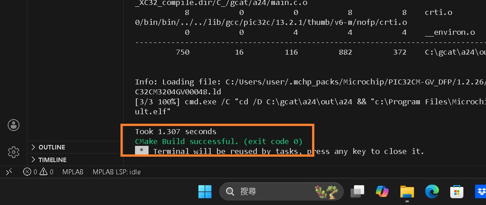
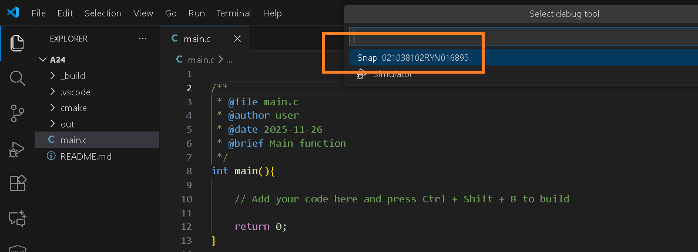
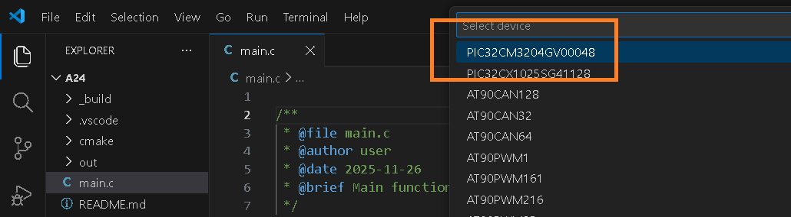

# Exercise 2 flash blank project by VScode

## create a blank project 
  
select [Creat MPLAB Project]  

  
name is "a24" , then press [Enter]   

  
select "Custom Location"  

  
If you select c:\gcat , the project at c:\gcat\a24\   

  
select MCU  

  
select compiler which you have  

  
Message of ok   

## build and program a blank project 

  
press ">", select MPLAB CMake:Clean Build 

  
Message of build ok  

  
press ">", select MPLAB:Program Device 

  
select hex file  

  
select programmer  

  
select MCU  

  
Message of prgramming ok  

