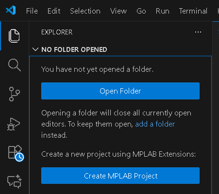
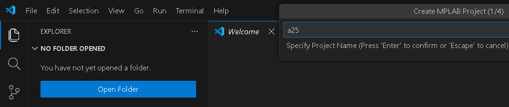
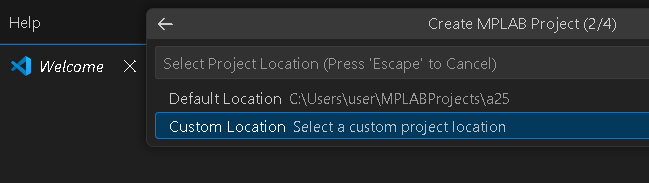
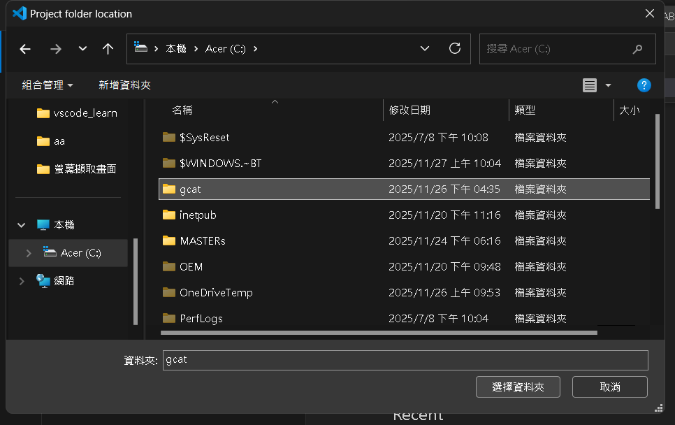
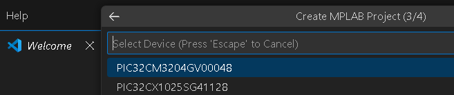
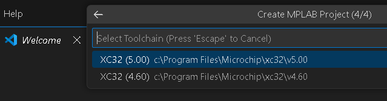
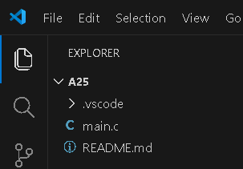

# Exercise 3 : LED1 test, MCC (microchip code configurator)

## Create a project
  
press ctrl+shift+p to open Explorer dialog. 
select [Creat MPLAB Project]  

  
Name project as a25  

  
select [Custom Location]  

  
select c:\gcat and VSCode save code to c:\gcat\a25  

  
select MCU of [PIC32CM3204GV00048]  

  
select compiler [XC32]  

  
Message for ok to create project   

