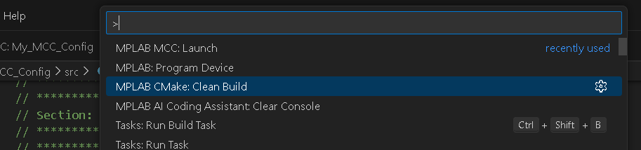
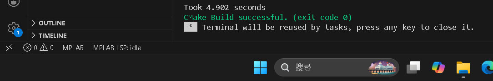
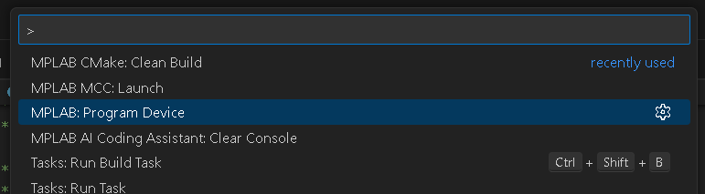
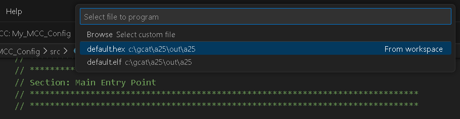
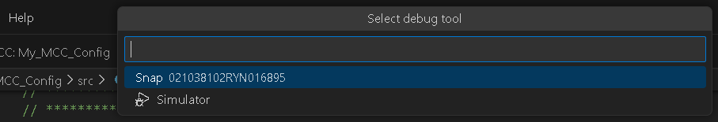
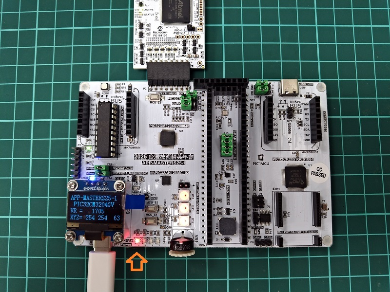

# Exercise 3 : LED1 test, MCC (microchip code configurator)

## build and program to device
  
press ctrl+shift+p to open command palette with MPLAB task.  
select [MPLAB CMake]  

  
Message for build ok  

  
press ctrl+shift+p to open command palette with MPLAB task.  
select [MPLAB Program Device]  

  
select [default hex]  

  
select program of [Snap]  

  
select MCU of [PIC32CM3204GV00048]  

  
Message for ok to  program device  

  
turn on LED1   

