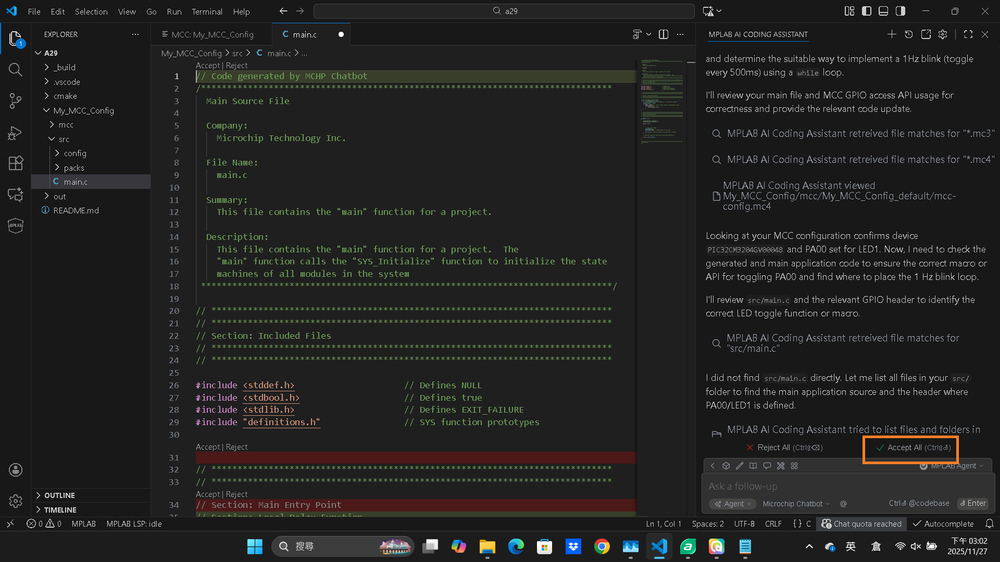

# Exercise 4 : Blink LED1 by AI coding

First, create a project and set PA00 as LED1 with MCC. It is the same as ex3.

  
select [Open Chat].  

  
select [MPLAB AI CODING ASSISTANT].  

  
Press the button indicated by the arrow.  

  
Press the button indicated by the arrow. Relink to server.  

  
Check the indicator is green.  
Select [Agent] mode.  

  
Fill in the prompt.  
please help me coding. I need a program for blinking LED with 1Hz. 
MCU is PIC32CM3204GV00048. 
I had set MCC, GPIO of PA00 as LED1. 
I want to use while loop to do it.  

  
Press button of [Accept All], AI will change the code at main.c  

Finally, build code and program device. 

# Ex4.2
please help me coding.  
I need a program for blinking LED with 500ms On and 500ms Off. 
I want to use systick to delay. 
MCU is PIC32CM3204GV00048. 
I had set MCC below 
-GPIO of PA00 as LED1. 
-systick 100 ms 
