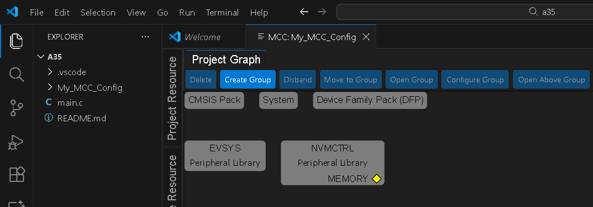
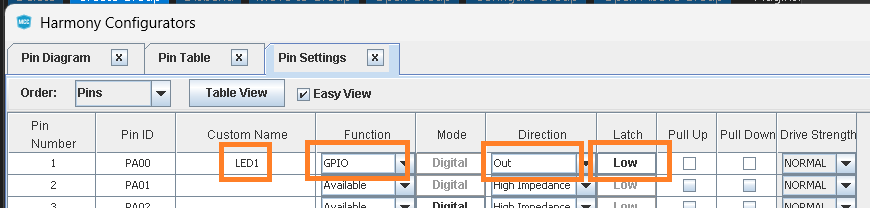
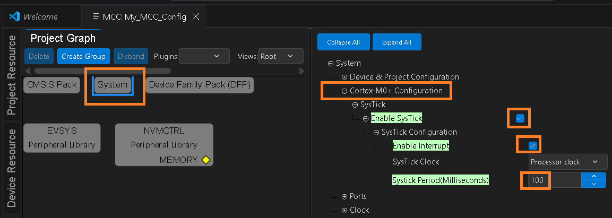
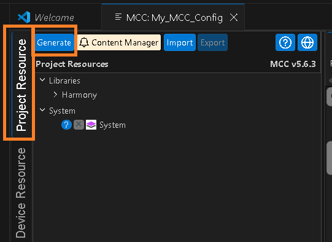
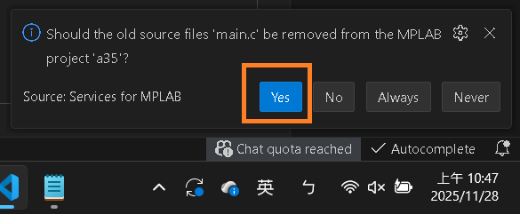
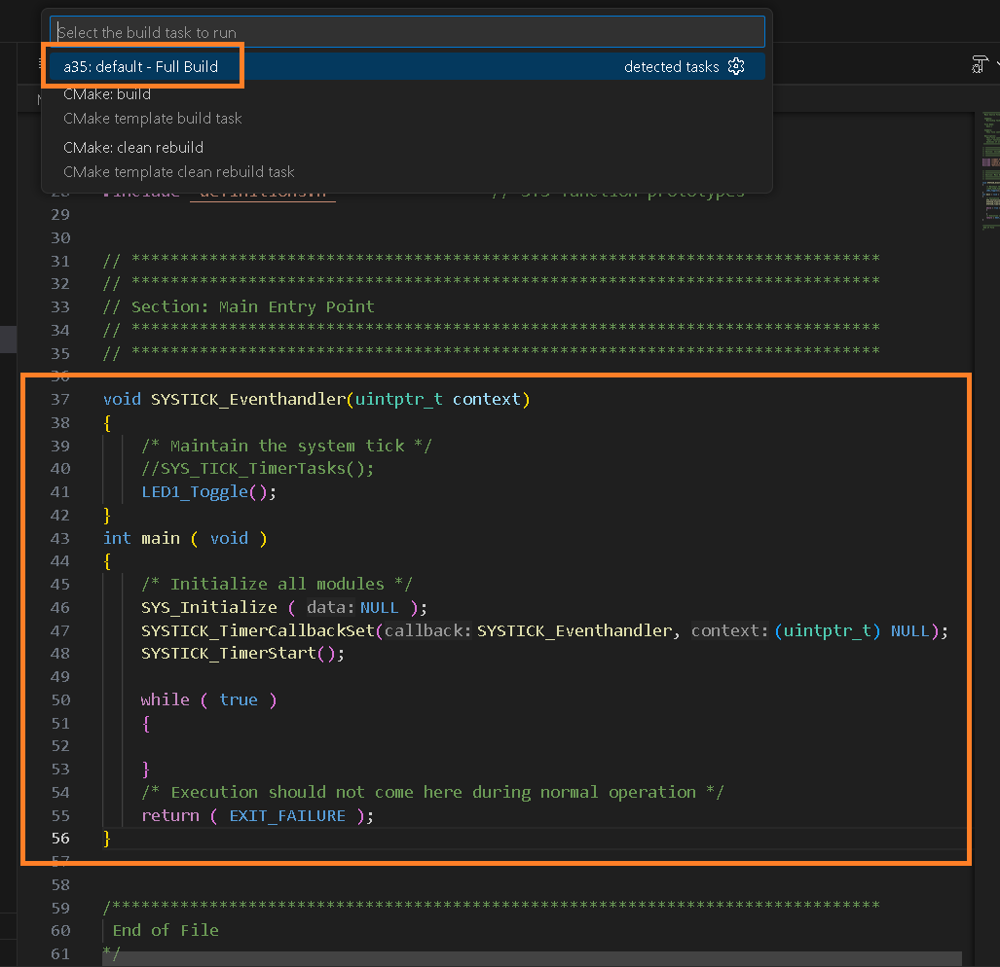
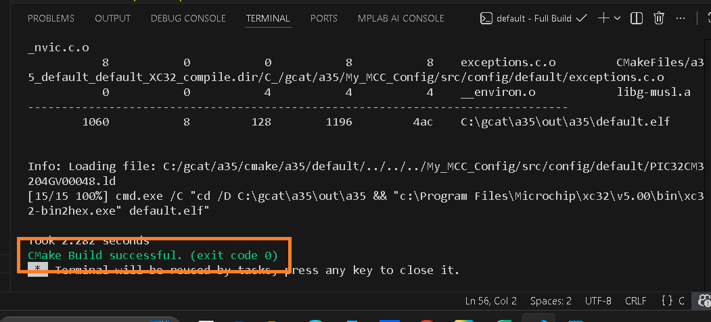
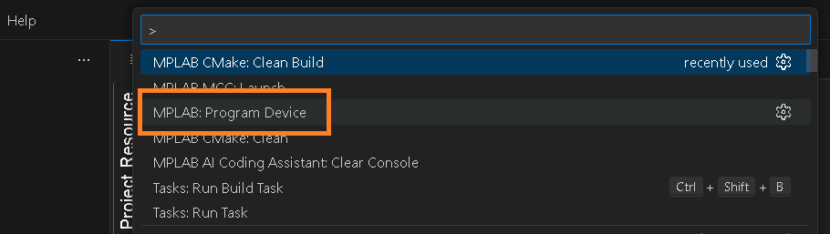
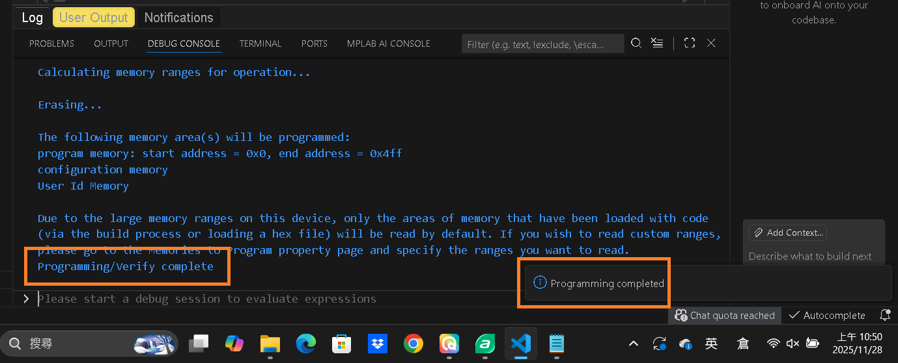

# Exercise 5 : Blinking LED with timer callback

  
Create a new project for EVK of APP-MASTERS25-1 and name project "a35". 
Start MCC.  

  
Name PA00 LED1. Setting function as GPIO, Direction as Out, Latch Low.  

  
Setting SysTick.  

  
select [Project Resource][Generate] to generate code to project.  

  
select [Yes] and MCC change the main.c .  

  
Adding code and build it.  

  
Message for ok to build.  

  
Program device with .hex .  

  
Message for ok to program device.  

