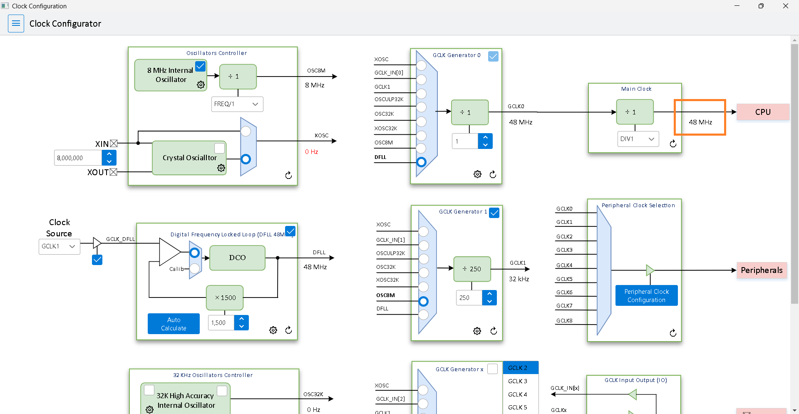
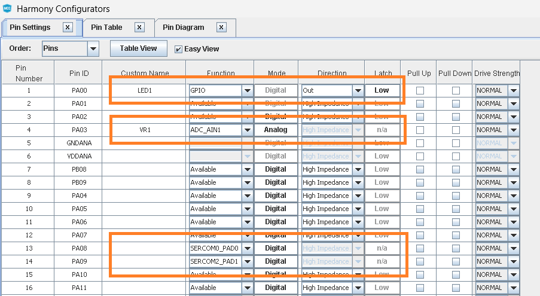
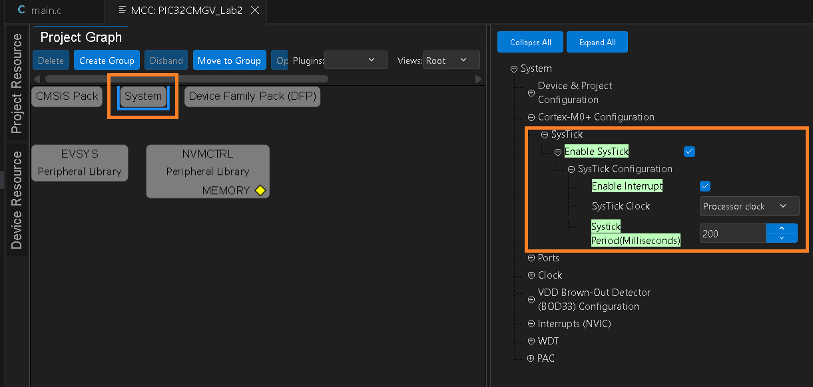
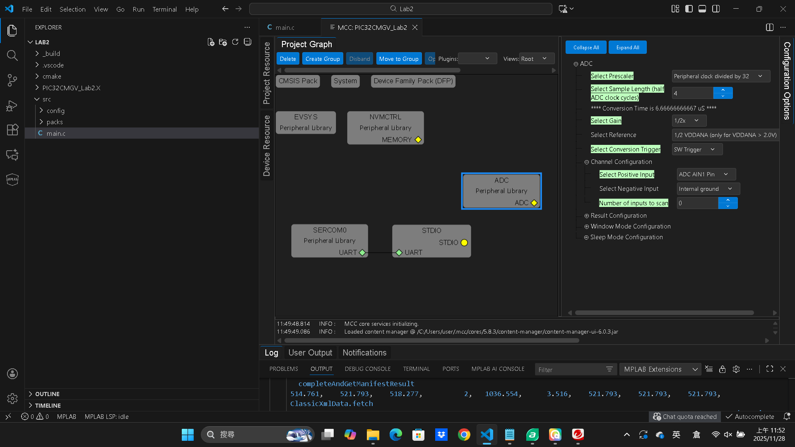
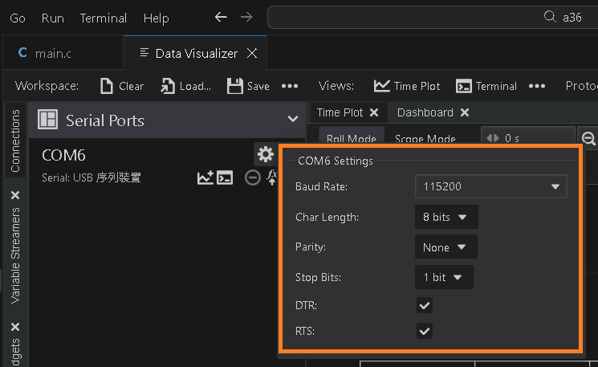
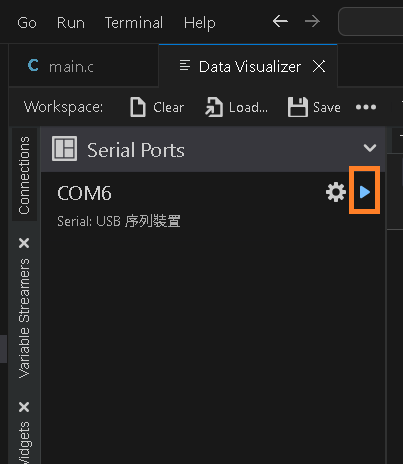
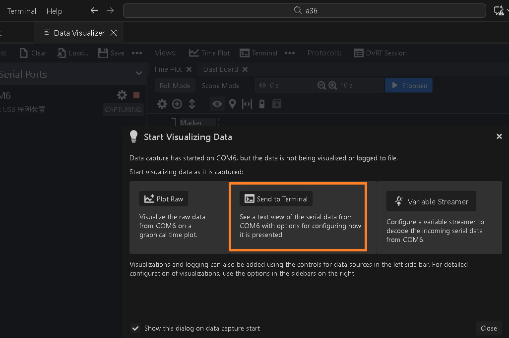
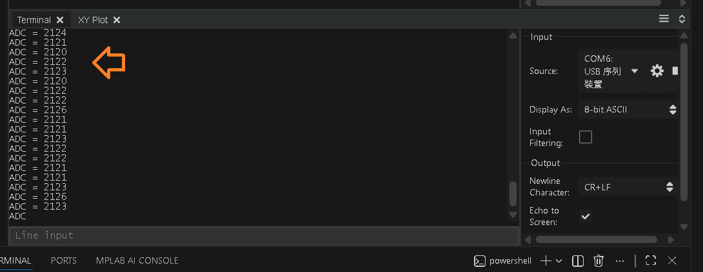

# Exercise 6 : ADC with timer callback, Data Visualizer

  
Create a new project for EVK of APP-MASTERS25-1 . 
Start MCC. 
Run [Plugins/Clock configuration] to check Main Clock.  

  
Run [Plugins/Pin configuration] to set pins.  

  
Set Systick as 200ms  

  
Form [Device Resource], add ADC, SERCOM0, STDIO to [Project Graph]  

  
Ok to add ADC, SERCOM0, STDIO   

  
Set parameter of ADC.  

  
Link SERCOM0 and STDIO. 
Set parameter of STDIO.  

  
Set parameter of SERCOM0. 
Project Resource / [Generate] to add MCC code to project. 
copy-paste code  form src/ex6/main.c to main.c of project. 
Do work of "build" and "program devcie."  

  
press ctrl+shift+p and select MPLAB:Data Visualizer.  

  
press the icon to set parameter of UART.  

  
Check Buad Rate.  

  
press the icon to display data.  

  
Select [Send to Terminal]  

  
Data Visualizer display the data for MCU.  
