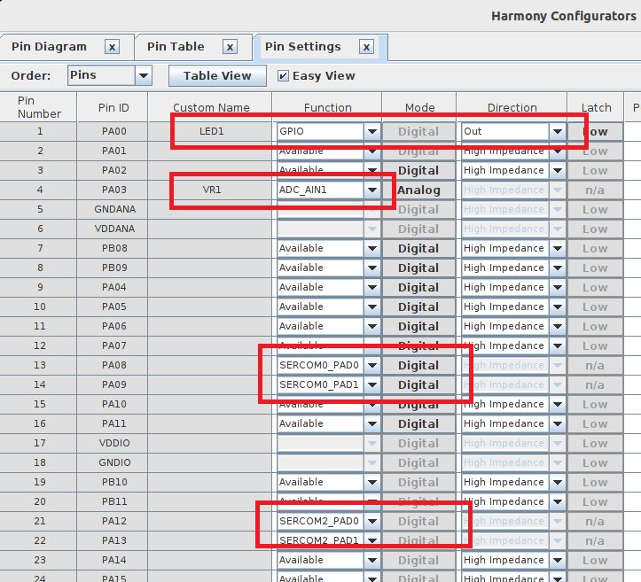
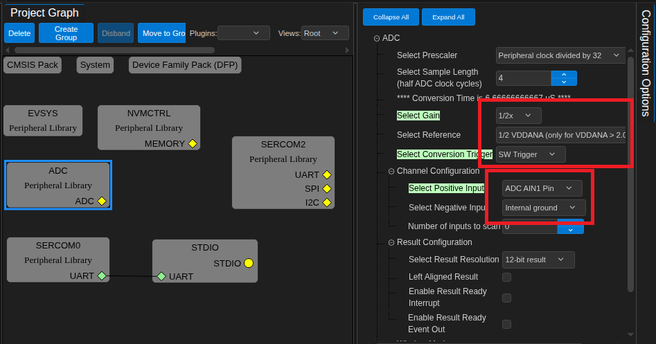
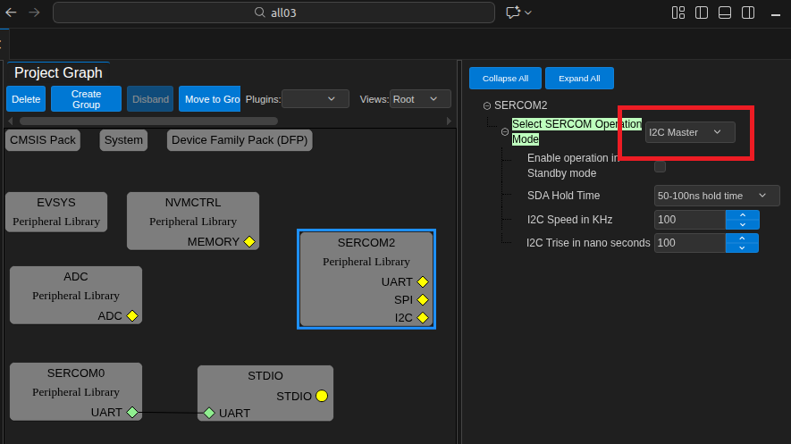
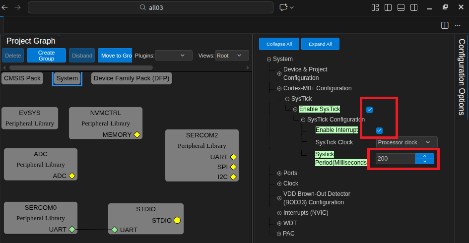
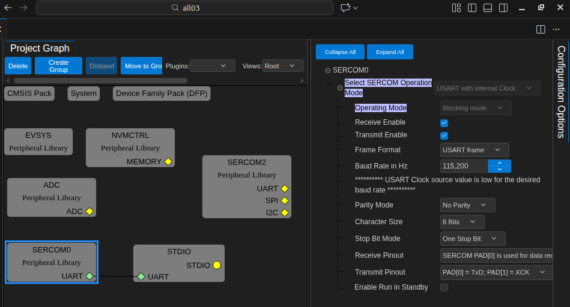
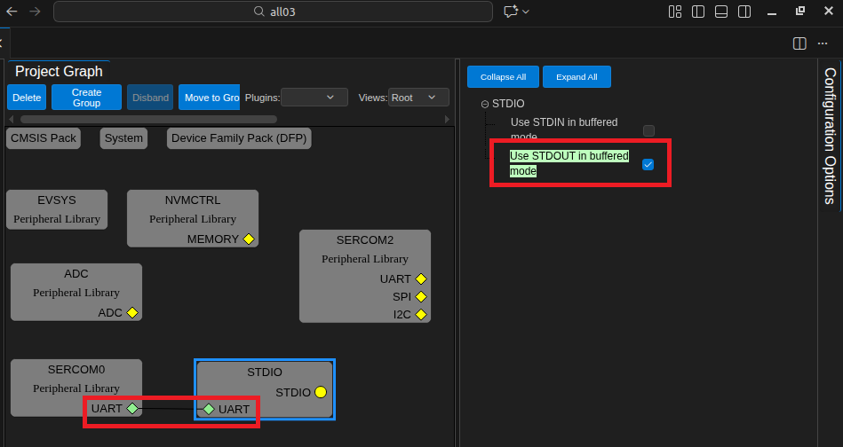
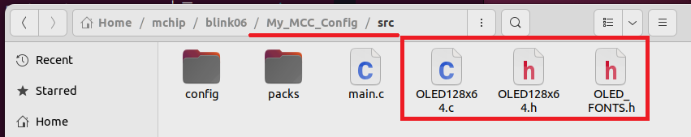
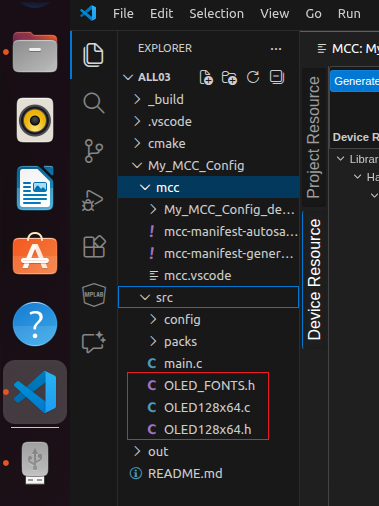
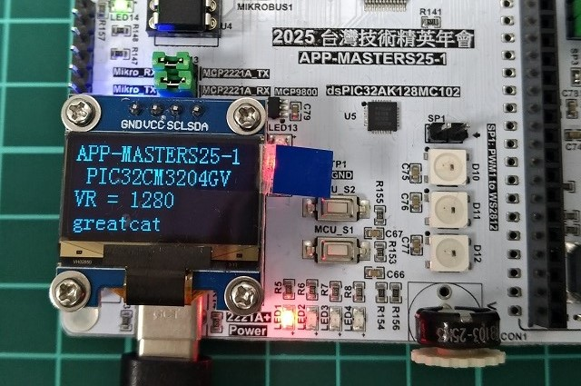

# Exercise 8 : I2C OLCD

  
MCC setting : pin   

  
MCC setting : ADC   

  
MCC setting : I2C   

  
MCC setting : SysTick   

  
MCC setting : UART   

  
MCC setting : STDIO   

  
copy file to folder   

  
VSCode add these file automatically  

  
RUN.  

