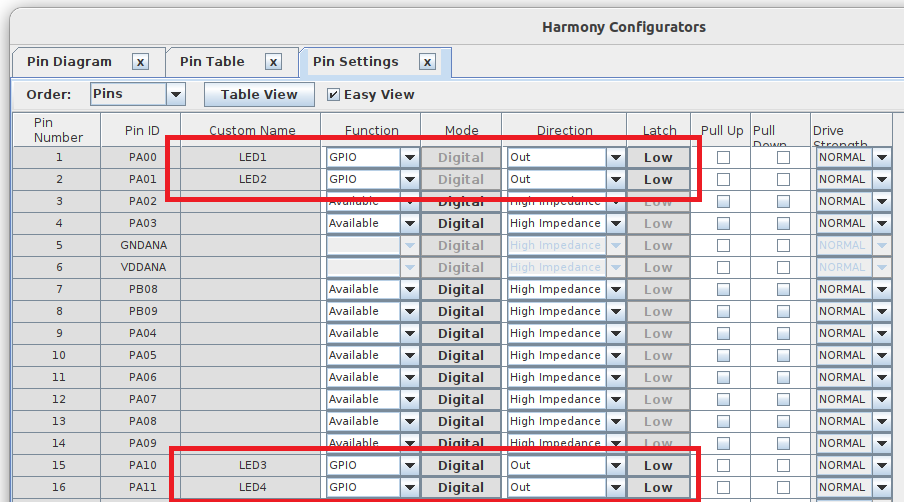
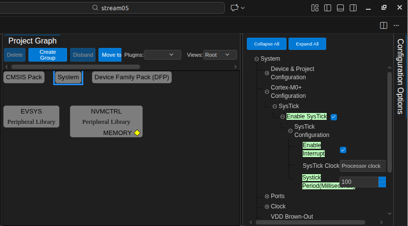
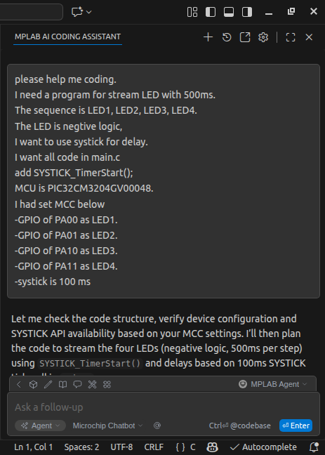

# Exercise 9 : Stream LED by AI coding

  
MCC setting : pin   

  
MCC setting : SysTick   

## prompt
  
please help me coding. 
I need a program for stream LED with 500ms. 
The sequence is LED1, LED2, LED3, LED4.  
The LED is negtive logic.  
I want to use systick for delay.  
I want all code in main.c  
add SYSTICK_TimerStart();  
MCU is PIC32CM3204GV00048.  
I had set MCC below  
-GPIO of PA00 as LED1.  
-GPIO of PA01 as LED2.  
-GPIO of PA10 as LED3.  
-GPIO of PA11 as LED4.  
-systick is 100 ms  

  
prompt for AI   